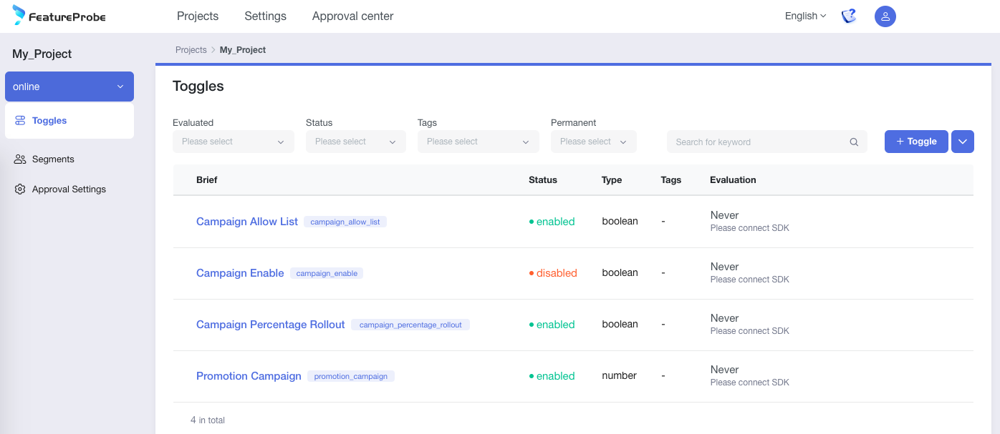
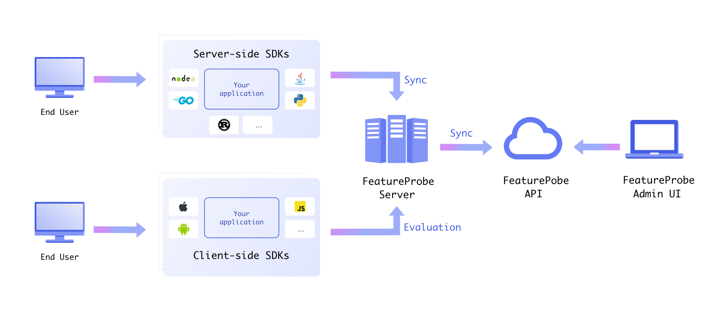

[](https://github.com/FeatureProbe/FeatureProbe)
[](https://github.com/FeatureProbe/FeatureProbe/releases)
[](https://hub.docker.com/u/featureprobe)
[](https://github.com/FeatureProbe/FeatureProbe/blob/main/LICENSE)
[](https://join.slack.com/t/featureprobe/shared_invite/zt-1b5qd120x-R~dDbpgL85GgCLTtfNDj0Q)
[](https://docs.featureprobe.io/)
[](https://docs.featureprobe.io/zh-CN/)
[](https://twitter.com/FeatureProbe)

# 跳转到[国内中文版](https://gitee.com/featureprobe/FeatureProbe/blob/main/README_CN.md)


# 💎 FeatureProbe 

FeatureProbe is an open source **feature management service**. 
It allows R&D, SRE and operation teams to launch new features or switch software implementations with confidence and lower risk.
FeatureProbe eliminates manual delays through its practice in continuous delivery and is not hindered by the size of a 
team or the complexity of a product, which allows developers to maintain their velocity. 
It also enables the operation team to change online service parameters within seconds or roll out configurations progressively 
without effort.

With over 5 years of usage in a company of 5000+ developers, we have seen the remarkable difference FeatureProbe makes
through the acceleration of daily development tasks. It also supports our million-user level product daily operations.

Now we are making this project open source to help more developers and operation people and contribute to the programming society. 

## 🚀 Why you should use FeatureProbe

FeatureProbe brings about value to our daily development and operations in these aspects:

1. **Reducing development effort to merge branches**. 
We can use feature toggles to set up gates for features on the 
main branch rather than creating branches for features. 
This can help us reduce time and effort from merging branches frequently and increase 
development velocity.
2. **Lowering down the time to recover**. 
Feature toggles can separate and limit service issues from spreading by turning off the problematic services or carrying
out service degradations. The SRE team can control the toggles on UI rather than waking up R&D on-call staff to do something.
3. **Saving testing environment cost**. 
FeatureProbe makes it possible to test new features in the production
environment by enabling them for a small portion of users and collecting feedback.
4. **One-stop configuration center for operation**. 
FeatureProbe provides a comprehensive and user-friendly management portal for configuring and managing features, 
rollout, rollback, peer reviews, accounts and permissions, the operation team can use the portal solely to set up and send out specific features/versions to 
certain users based on their geolocation or other factors. 
5. **Doing A/B testings to get insights**. 
FeatureProbe helps the operation team do online A/B testing easily and gain insight
from different marketing/sales strategies, which is one of the key factors in increasing the product or service's 
sales performance.
6. **And more!** 
Discover all the amazing things FeatureProbe can accomplish. 

 

## 💡 Core Concepts

Introduction of FeatureProbe architecture and how to use it.

### 🧩 Architecture of FeatureProbe

The overall architecture of FeatureProbe is shown in the following figure



* Management Center
   * front-end: [Admin UI](https://github.com/FeatureProbe/FeatureProbe/tree/main/feature-probe-ui), 
   * back-end: [API](https://github.com/FeatureProbe/FeatureProbe/tree/main/feature-probe-api), 

* FeatureProbe [Server](https://github.com/FeatureProbe/feature-probe-server)

* SDKs
   * Client-Side SDKs
   * Server-Side SDKs


### 🍭 Get Started in 2 Steps

#### 1️⃣ Start FeatureProbe Central Service

1. We provide a online try-out FeatureProbe Service, so you don't have to deploy by yourself, just visit it [Here](https://featureprobe.io).

1. Or you can use docker composer to set your own FeatureProbe service

   * Make sure you have [`git`](https://git-scm.com/) and [`docker`](https://www.docker.com/) installed. 。
   * Clone the repository to your server and boot up the services. Change the ports defined in docker-compose.yml as needed.
   
   ``` bash
       git clone https://github.com/FeatureProbe/FeatureProbe.git
       cd FeatureProbe
       docker compose up
   ```
   * Visit the service on [http://localhost:4009](http://localhost:4009) with a browser and use the default credentials to log in.
        - username: `admin`
        - password: `Pass1234`

#### 2️⃣ Use FeatureProbe SDK in your application

Import FeatureProbe SDK in your app, and check the Feature Toggle status in your code like the following pseudo-code:

~~~ java
if (fpClient.boolValue(YOUR_TOGGLE_KEY, user, false)) {
  // Do some new thing;
} else {
  // Do the default thing;
}
~~~

We have SDKs for the following program languages, choose one for your application.

##### 💻 **Server Side SDK**

* [Java SDK](https://github.com/FeatureProbe/server-sdk-java)
* [Rust SDK](https://github.com/FeatureProbe/server-sdk-rust)
* [Golang SDK](https://github.com/FeatureProbe/server-sdk-go)
* [Python SDK](https://github.com/FeatureProbe/server-sdk-python) by [@HeZean](https://github.com/HeZean)
* [Node.js SDK](https://github.com/FeatureProbe/server-sdk-node) by [@HeZean](https://github.com/HeZean)

##### 📲 **Client Side SDK**

* [Javascript SDK](https://github.com/FeatureProbe/client-sdk-js)
* [Android SDK](https://github.com/FeatureProbe/client-sdk-mobile)
* [iOS SDK](https://github.com/FeatureProbe/client-sdk-mobile)
* [Mini Program SDK](https://github.com/FeatureProbe/client-sdk-miniprogram)
* [React SDK](https://github.com/FeatureProbe/client-sdk-react)

> We also provide a online [FeatureProbe Demo](https://featureprobe.io/demo/) application, with FeatureProbe Javascript SDK embeded, controlled by FeatureProbe [online try-out service](https://featureprobe.io), you can try out FeatureProbe functions on this demo website.


## 📚 More information

Please visit our [Documentation](https://docs.featureprobe.io/)

## 🙌 Contributing

We are working on continue evolving FeatureProbe core, making it flexible and easier to use. 
Development of FeatureProbe happens in the open on GitHub, and we are grateful to the 
community for contributing bugfixes and improvements.

Please read [CONTRIBUTING](CONTRIBUTING.md) for details on our code of conduct, and the process for 
taking part in improving FeatureProbe.


## 📜 License

This project is licensed under the Apache 2.0 License - see the [LICENSE](LICENSE) file for details.


## 🌈 Community and Sharing

We are growing a community to help newcomer to learn FeatureProbe. Don't hesitate to reach out for help.

If you want ask open questions about FeatureProbe, feature management or discuss these topics in general, join us on [](https://join.slack.com/t/featureprobe/shared_invite/zt-1b5qd120x-R~dDbpgL85GgCLTtfNDj0Q) 

Or if you prefer to talk in chinese, join our wechat group: 


For Bug report or new feature requirement, create a [GitHub issue](https://github.com/FeatureProbe/FeatureProbe/issues/new/choose) for us.

## 🎢 Star History

[](https://star-history.com/#FeatureProbe/FeatureProbe&Date)

