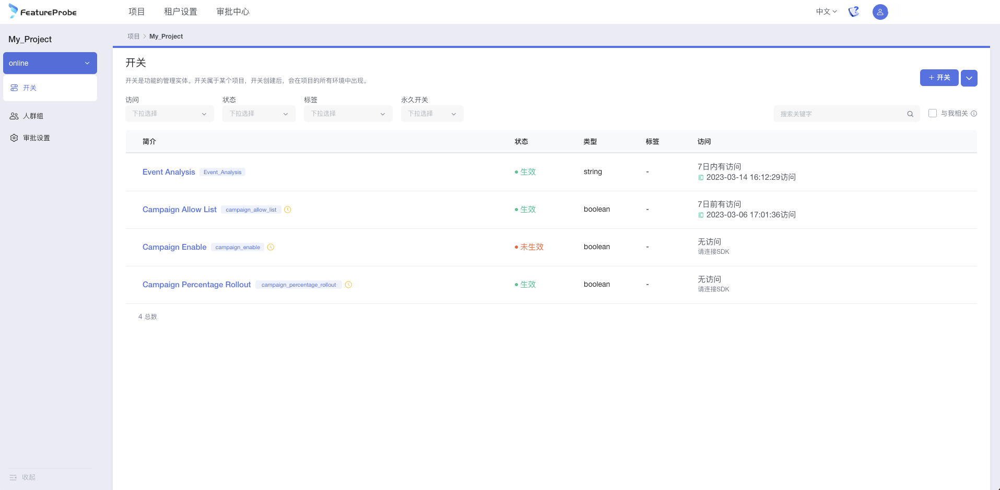

[](https://github.com/FeatureProbe/FeatureProbe)
[](https://hub.docker.com/u/featureprobe)
[](https://github.com/FeatureProbe/FeatureProbe/blob/main/LICENSE)
[](https://join.slack.com/t/featureprobe/shared_invite/zt-1b5qd120x-R~dDbpgL85GgCLTtfNDj0Q)
[](https://twitter.com/FeatureProbe)


# FeatureProbe

FeatureProbe is our open source **feature management service**. 
It allows R&D, SRE and operation teams to launch new features or switch software implementations with confidence and lower risk.
FeatureProbe eliminates manual delays through its practice in continuous delivery and is not hindered by the size of a 
team or the complexity of a product, which allows developers to maintain their velocity. 
It also enables the operation team to change online service parameters within seconds or roll out configurations progressively 
without effort.

With over 5 years of usage in a company of 5000+ developers, we have seen the remarkable difference FeatureProbe makes
through the acceleration of daily development tasks. It also supports our million-user level product daily operations.

Now we are making this project open source to help more developers and operation people and contribute to the programming society. 

### Why you should use FeatureProbe

FeatureProbe brings about value to our daily development and operations in these aspects:

1. **Reducing development effort to merge branches**. 
We can use feature toggles to set up gates for features on the 
main branch rather than creating branches for features. 
This can help us reduce time and effort from merging branches frequently and increase 
development velocity.
2. **Lowering down the time to recover**. 
Feature toggles can separate and limit service issues from spreading by turning off the problematic services or carrying
out service degradations. The SRE team can control the toggles on UI rather than waking up R&D on-call staff to do something.
3. **Saving testing environment cost**. 
FeatureProbe makes it possible to test new features in the production
environment by enabling them for a small portion of users and collecting feedback.
4. **One-stop configuration center for operation**. 
FeatureProbe provides a comprehensive and user-friendly management portal for configuring and managing features, 
rollout, rollback, peer reviews, accounts and permissions, the operation team can use the portal solely to set up and send out specific features/versions to 
certain users based on their geolocation or other factors. 
5. **Doing A/B testings to get insights**. 
FeatureProbe helps the operation team do online A/B testing easily and gain insight
from different marketing/sales strategies, which is one of the key factors in increasing the product or service's 
sales performance.
6. **And more!** 
Discover all the amazing things FeatureProbe can accomplish. 


 


## Getting Started

FeatureProbe includes several key components, such as 
[API Server](https://github.com/FeatureProbe/feature-probe-api/blob/master/README.md), 
[Evaluation Server](https://github.com/FeatureProbe/feature-probe-ui/blob/master/README.md), 
 [UI/Portal](https://github.com/FeatureProbe/feature-probe-ui/blob/master/README.md), 
database and SDKs for 
different coding languages. 

You can boot up all the key components together through Docker compose, which will be sufficient for most use cases.
In special circumstance, you may want to boot up these components independently on different servers, by using 
Docker images, or by modifying the source code and building/deploying your own version. 


### 1. Starting FeatureProbe Service with Docker Compose

Make sure you have [`git`](https://git-scm.com/) and [`docker`](https://www.docker.com/) installed.

Clone the repository to your server and boot up the services. Change the ports defined in docker-compose.yml as needed.

``` bash
git clone https://github.com/FeatureProbe/FeatureProbe.git
cd FeatureProbe
docker compose up
```
*For users in Mainland China, please refer to [configure mirror](DOCKER_HUB.md) to speed up your download.*

Go to UI/Portal at `localhost:4009` and use the default credentials to log in. 
Note that you should replace `4009` with your port number if you made any changes previously. 
Remember to update the admin password after your first time login.

  - username: `admin`
  - password: `Pass1234`

### 2. Importing SDK and Configuring Toggles in Your Code Base

There are two types of SDKs for FeatureProbe. 

The first one is server-side SDK. These SDKs work in server side applications (such as 
[Java SDK](https://github.com/FeatureProbe/server-sdk-java/blob/master/README.md), 
[Rust SDK](https://github.com/FeatureProbe/server-sdk-rust/blob/master/README.md)
) and use configuration 
data fetched from FeatureProbe Server to evaluate the variation results. They are flexible to allow you adding your own 
configurations or rules on top of the ones from the Server.

The second one is client-side SDK. These SDKs work in client side applications (such as [Javascript SDK](https://github.com/FeatureProbe/client-sdk-js/blob/master/README.md), 
or [mobile SDK](https://github.com/FeatureProbe/client-sdk-mobile/blob/master/README.md) for iOS and Android) and
use the evaluation results provided by FeatureProbe Server. The usage is straightforward and only getting evaluation results
from FeatureProbe Server can guarantee the client side performance and data security.


Find out the available coding language-specific SDK here and try them out in your applications.

**Server Side SDK**
* [Java SDK](https://github.com/FeatureProbe/server-sdk-java)
* [Rust SDK](https://github.com/FeatureProbe/server-sdk-rust)
* [Golang SDK](https://github.com/FeatureProbe/server-sdk-go)
* [Python SDK](coming soon...)


**Client Side SDK**
* [Javascript SDK](https://github.com/FeatureProbe/client-sdk-js)
* [Android SDK](https://github.com/FeatureProbe/client-sdk-mobile)
* [iOS SDK](https://github.com/FeatureProbe/client-sdk-mobile)

### 3. API Endpoints Documentation

Checkout the API endpoints at `http://localhost:4009/api-docs` after you boot up the service locally. You may 
need to modify the host address and port if you deploy the services in a different way.

### 4. Examples

We provide several use cases to reflect our practises of using FeatureProbe to carry out feature configurations
gradually, doing service degradation, and doing A/B testing. Check them out at 
[User Guide](https://github.com/FeatureProbe/featureprobe/blob/master/USER_GUIDE.md).


## Contributing
We are working on continue evolving FeatureProbe core, making it flexible and easier to use. 
Development of FeatureProbe happens in the open on GitHub, and we are grateful to the 
community for contributing bugfixes and improvements.

Please read [CONTRIBUTING](CONTRIBUTING.md) for details on our code of conduct, and the process for 
taking part in improving FeatureProbe.


## License

This project is licensed under the Apache 2.0 License - see the [LICENSE](LICENSE) file for details.


## Community and Sharing

We are growing a community to help newcomer to learn FeatureProbe. Don't hesitate to reach out for help.

If you want ask open questions about FeatureProbe, feature management or discuss these topics in general, join us on [](https://join.slack.com/t/featureprobe/shared_invite/zt-1b5qd120x-R~dDbpgL85GgCLTtfNDj0Q) 

Or if you prefer to talk in chinese, join our wechat group: 


For Bug report or new feature requirement, create a [GitHub issue](https://github.com/FeatureProbe/FeatureProbe/issues/new/choose) for us.

## Star History

[](https://star-history.com/#FeatureProbe/FeatureProbe&Date)

