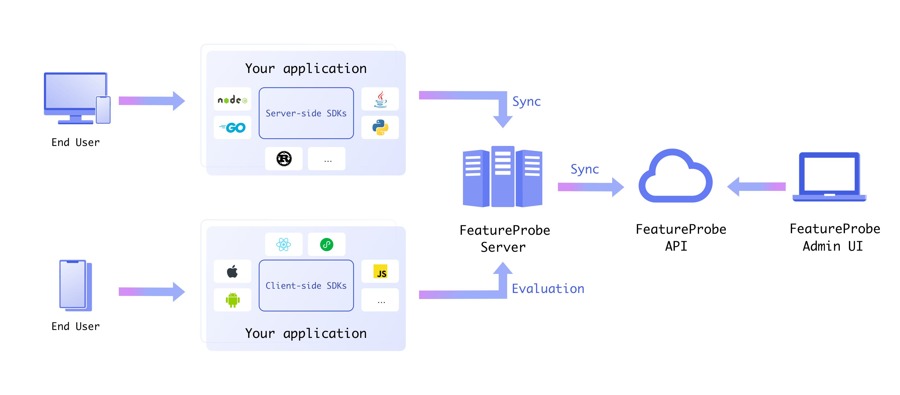

# 💎 FeatureProbe

FeatureProbe 是一个开源的 **『特性』管理** 服务。它包含灰度放量、AB实验、实时配置变更等针对『特性粒度』的一系列管理操作。这里的『特性』包含业务功能、技术改造、运营活动等任何涉及代码开发的『特性』。它可以让开发人员、运营人员、运维人员安全、高效的完成线上变更，同时精细控制变更风险。『特性』粒度的发布管理是实现DevOps的核心工具之一，通过『特性』开关，可以降低分支开发带来的合并复杂性，轻松实现主干开发以及持续交付。

『特性』粒度开关管理服务已经是各个互联网大厂的标配平台，我们将互联网大厂内部『特性』开关管理平台的优秀实践与经验融入这个开源项目中。希望推广**特性管理**理念和实践在软件开发社区的普及，携手开源社区，提升软件开发行业的效能。

## 📚 [文档服务](https://docs.featureprobe.io/zh-CN/)

我们提供一个独立的文档服务，最新的文档将会更新在[这里](https://docs.featureprobe.io/zh-CN/)

## 🚀 FeatureProbe适用于哪些场景

根据我们的经验，FeatureProbe可以在以下场景中提升软件研发的效能:

1. **『特性粒度』灰度发布**:
每个功能独立灰度发布给用户。可迅速关闭受BUG影响的功能，同时不影响其他正常功能的使用。
3. **降低测试环境搭建成本**:
节约测试环境搭建和线下测试时间成本。利用线上环境小流量测试，环境真实同时影响可控。
2. **降低故障恢复时间**:故障发生时通过降级策略调整服务行为，保障用户主路径不受影响。
3. **简化研发协同方式**: 
用功能开关替代传统分支开发的团队协同模式。真正实现主干开发、持续部署。减少分支合并冲突，显著加快迭代速度。
4. **统一的配置管理中心**:
通过用户友好的操作页面，统一操作线上配置，实时修改功能参数，让运营活动生效更简单。
6. **更多的使用场景!** 
期待大家与我们一起去发现与尝试。

 

# 🧩 FeatureProbe的技术架构

FeatureProbe 的总体架构如下图所示：

* 特性管理平台
   * 前端: [Admin UI](https://github.com/FeatureProbe/FeatureProbe/tree/main/feature-probe-ui), 提供用户操作页面
   * 后端: [API](https://github.com/FeatureProbe/FeatureProbe/tree/main/feature-probe-api),提供核心数据管理和对外API。

* FeatureProbe [Server](https://github.com/FeatureProbe/feature-probe-server)处理SDK的链接，提供高性能的规则判定引擎。

* 各语言SDK
   * Client-Side SDKs
   * Server-Side SDKs

# 🍭 2步体验FeatureProbe

## 1️⃣ 启动FeatureProbe核心服务

1. 我们提供一个在线的FeatureProbe体验核心服务[FeatureProbe](https://featureprobe.io)，您可以直接访问，省去自己部署服务的步骤。

2. 您也可以在自己服务器使用docker composer来部署一套自己的FeatureProbe服务：详见[教程](https://docs.featureprobe.io/zh-CN/tutorials/setup_own_env)

## 2️⃣ 在你自己服务代码中调用FeatureProbe SDK

在您App的代码中引入FeatureProbe的SDK，并通过类似以下的代码访问在FeatureProbe平台上创建的开关

~~~ java
if (fpClient.boolValue(YOUR_TOGGLE_KEY, user, false)) {
  // Do some new thing;
} else {
  // Do the default thing;
}
~~~

我们提供如下语言的SDK：

### 💻 **服务端SDK**

* [Java SDK](https://gitee.com/FeatureProbe/server-sdk-java)
* [Rust SDK](https://gitee.com/FeatureProbe/server-sdk-rust)
* [Golang SDK](https://gitee.com/FeatureProbe/server-sdk-go)
* [Python SDK](https://gitee.com/FeatureProbe/server-sdk-python) by [@HeZean](https://github.com/HeZean)
* [Node.js SDK](https://github.com/FeatureProbe/server-sdk-node) by [@HeZean](https://github.com/HeZean)

### 📲 **客户端SDK**

* [Javascript SDK](https://gitee.com/FeatureProbe/client-sdk-js)
* [Android SDK](https://gitee.com/FeatureProbe/client-sdk-mobile)
* [iOS SDK](https://gitee.com/FeatureProbe/client-sdk-mobile)
* [Mini Program SDK](https://gitee.com/featureprobe/client-sdk-miniprogram)
* [React SDK](https://gitee.com/featureprobe/client-sdk-react)

各语言SDK都提供example目录和代码，可以直接运行example代码来体验FeatureProbe平台与SDK的交互。

> 我们提供了一个受FeatureProbe控制的模拟网站应用（通过使用JS SDK）。你可以在线体验通过FeatureProbe控制网站应用的展示。见[教程](https://docs.featureprobe.io/zh-CN/tutorials/try_demo/)

# 🙌 Contributing

我们仍在不断迭代，为FeatureProbe补充更多的功能，以便适应更多的使用场景和用户需求。开发活动会基于github的代码库持续发布。欢迎开源社区的朋友加入我们，提需求、报bug、参与社区讨论、提交PR都可以。

Please read [CONTRIBUTING](CONTRIBUTING.md) for details on our code of conduct, and the process for 
taking part in improving FeatureProbe.

# 📜 License

This project is licensed under the Apache 2.0 License - see the [LICENSE](LICENSE) file for details.

# 🌈 Community and Sharing

🍻 我们搭建了一个微信社区，帮助新朋友尽快了解FeatureProbe，新老朋友们也可以在社区一起讨论关于特性管理(Feature Management)相关的任何话题. 扫描以下二维码加入我们。

🙋 如果想上报BUG，或者贡献代码，请使用Github的Issue和PR功能： [GitHub issue](https://github.com/FeatureProbe/FeatureProbe/issues/new/choose) 

# 🎢 Star History

如果FeatureProbe能帮到您，请⭐️star我们~

