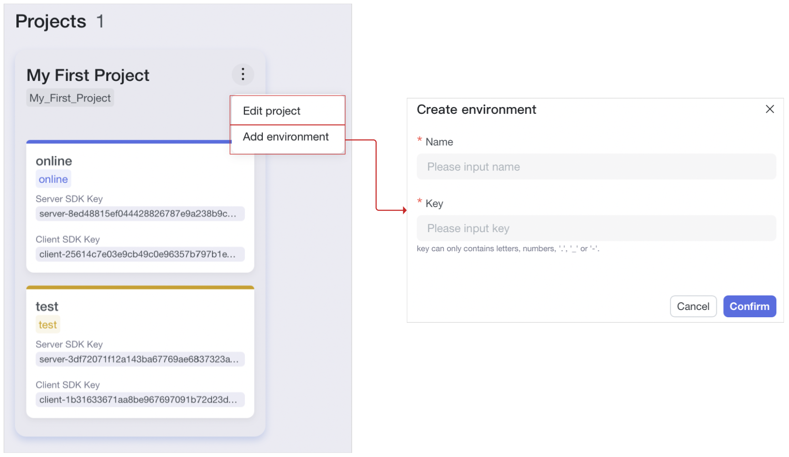
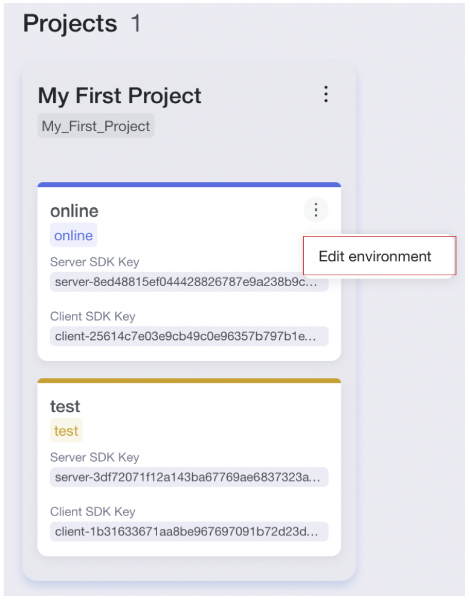
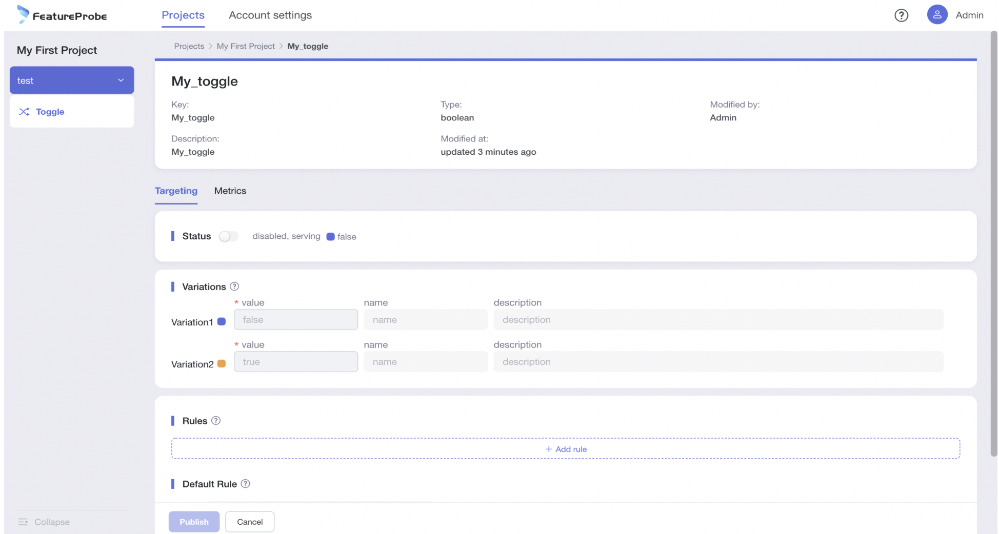
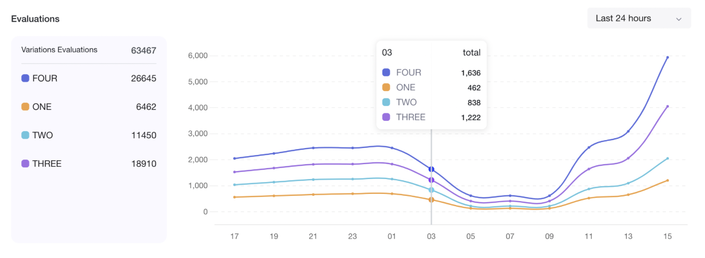

# User Guide

The FeatureProbe User Guide provides an overview of FeatureProbe, instructions on how to set up accounts and projects, 
and complete examples of adding, editing and using feature toggles.


## Popular Use Cases

New features launching or version release are the most common use of FeatureProbe. When we launch a new feature or update the service, we can enable them for a small fraction of the users in the first place to make sure things go 
smoothly without impacting the majority of users. If those users don't complain or even give good feedback, we 
can populate the changes to more users, and repeat the procedure till all users update to the new version.

Further more, there are many other scenarios where we can use FeatureProbe.

### Online Promotion Activities
 
 Many companies periodically carry out promotion activities to boost sales. 
These activities use similar templates in most cases, and the operation team just need to modify several 
parameters to create a new promotion.

- Use Case: An online shopping platform carries out a Black Friday sales gala and needs to change prices for many 
   items. In the past, the R&D team change items prices and launch the changes with a long workflow. Now they can use 
   FeatureProbe to toggle the items price and make them effective within a second.

- Operation Procedure
   
     * The online sales operation team adds a new project named "My First Project" and adds a feature toggle 
   named "commodity\_spike\_activity" for the "online" environment. Shown in below picture:
    * The developer imports the FeatureProbe SDK in the code base (Java code as an example), and uses the "commodity\_spike\_activity" toggle 
   by setting the sdk Key which is assigned by FeatureProbe to "My First Project" "online" environment. 
   The variations type is number, and the user parameter is "city". 
  
    ```java
   FPUser user = new FPUser(user_id);
   user.with("city", city_name);
   double discount = fpClient.numberValue("commodity_spike_activity", user, 1.0);
   discountSetTo(discount);
    ```
  
   * The developer launches code base. Then operation people enable the toggle to make the city based pricing incentive
   policy get effective.
   * If the operation team needs to change prices, they can change the price variation settings on the FeatureProbe UI easily.

### Service Degradation

When the online service encounters extremely high demands that impact some dependency services 
or there is something goes wrong (for example, a backend service gets inaccessible unexpectedly), we need to guarantee 
the essential services work without disruption by using the cached data rather than fetching data from those problem services.

- Use Case: The ecommerce service needs to call an inventory stocking service to show the product stocking information.
   If the stocking service encounters some issue and is not available, the operation team can make use of FeatureProbe to 
   get stocking data from the cached content within a second and carry out the time costly application fallback operation 
   or switch over to a backup service without interrupt the online service.
   
- Operation Procedure
   * The R&D team adds a new project named "My First Project" and adds a feature toggle 
   named "store\_service\_fallback" for the "online" environment. Shown in below picture:
   * The developer imports the FeatureProbe SDK in the code base (Java code as an example), and uses the "store\_service\_fallback" toggle 
   by setting the sdk Key which is assigned by FeatureProbe to "My First Project" "online" environment. 
   The variations type is boolean, and its result enables or disables the degradation.  
  
   ```java
    FPUser user = new FPUser(user_id);
    boolean fallback = fpClient.boolValue("store_service_fallback", user, false);
    if (fallback) {
    	// Do something.
    } else {
    	// Do normal process.
    }
   ```
		   
   * When there is something wrong with the dependency services, the operation team can change the variation from False to 
   True to enable the degradation with cached/staled data to prevent service from being interrupted.

### A/B Testing

Design several solutions for a specific service, try them all and find out the most optimal/popular one.
 
- Use Case 1: Decide a button's color. Mike, the product manager, wants to change a "Buy" button for their ecommerce 
   platform in Paris. The original color is in red, and he believes the Paris people would like blue, and he also wants 
   to try green. He uses FeatureProbe to do the A/B testing to find out the better choice.
- Operation Procedure
   * The operation team adds a new project named "My First Project" and adds a feature toggle 
   named "color\_ab\_test" for the "online" environment. Shown in below picture:
   * The developer imports the FeatureProbe SDK in the code base (Java code as an example), and uses the "color\_ab\_test" toggle 
   by setting the sdkKey which is assigned by FeatureProbe to "My First Project" "online" environment. 
   The variations type is string, and the user parameter is "city". 
   
	```java
    FPUser user = new FPUser(user_id);
    user.with("city", city_name);
    String color = fpClient.stringValue("color_ab_test", user, "red");
    setButtonColor(color);
	```
	   
   * The developer launches code base. Then operation people enable the toggle to make the city based color setting
   get effective.
   * After several days of testing, Mike finds out that Paris people click the purchase button more when it is in blue,
   and he carries our the configuration to show blue button for all Paris customers.
   
One More Thing: We provide a small trick in the demo project that enables you to display different logos for 
different browsers. Try to find it out and make your website a little more interesting.

# Main Features

## Login
You can use a valid account and its password to log in the FeatureProbe portal. 
If it is the first time you log in a FeatureProbe service, you can use the default administrator account as 
`Admin/Pass1234`. Remember to change the password after you log in for the first time.

## Accounts Management

### Creating Accounts
Use an Administrator account to log in the FeatureProbe portal and create new accounts at the `Account Settings` page with below steps:

1. Click the `+ Member` button in blue.
2. Fill in account name in the `Accounts` field. You can massively create accounts by filling multiple accounts and 
separating them with commas.
3. By default, FeatureProbe assigns a default password to a newly created account.
4. Or you can uncheck the `Default Password` and use your own password.
5. Click `Add` button in the upper right corner to finish account creation.

**Note**: new accounts will get effective immediately after they are created.


### Editing Accounts

The default "Admin" account cannot be edited by any account, and it can edit any other account.

You can edit an account's password and save it to make the edit effective.

**Node**: the account member will be automatically logged out if you edit its password and there is no activities of the 
logged in account.


### Deleting Accounts

The default "Admin" account cannot be deleted by any account, and it can delete any other account.

Click `delete` button and `Confirm` to delete it on the pop-up window.

**Note**: Once an account has been deleted, you cannot create another account by using the same name.


### Changing Password

It is highly recommended changing an account's default password immediately after it is created with below steps:

1. Fill in the old password
2. Fill in the new password
3. Fill in the new password again and make sure the two new passwords are identical.
4. Click "Save" button to finish changing password. 

## Projects Management

### Creating Projects 

One FeatureProbe account can manage multiple business objects by setting up Projects. For example, you can create a 
project named "mobile client side app" and another project named "server side app", and set up its unique environments 
and toggles respectively. The FeatureProbe system provides a default initial project named "My First Project" and it has
two environments, `test` and `online`. You can add more projects in the `Projects` tab.

Here are the steps to add a new project:

1. Click `Projects` tab to enter the projects page.
2. Click the `+ Project` button in the top-right corner and open a new drawer page on the right to create a project.
3. Enter new project's name.
4. Enter key. It is a unique value to define a project and cannot be changed once the project is created.
5. Enter project descriptions.
6. Create the project by clicking the `Create` button at the top of the drawer window. Now the project is created, and 
it cannot be deleted.
7. Click a card (a card has the name of a specific environment, such as `test` or `online`) under a project to enter a 
specific environment page and see the toggles.


### Editing Projects

You can choose to edit a project by clicking the three-vertical-dot icon in the top-right corner of a project.

You can modify the selected project's name or/and description and save to make the changes into effective.


### Adding Project Environment

You can add new environments for your project and make the toggles accessible for different environment.

Here are the steps to add a new environment:

1. Click the three-vertical-dot icon in the top-right corner of a project and choose the `Add environment` menu item.
2. Fill in the environment name.
3. Fill in a key. It must be unique within a project, and it cannot be changed once an environment is created.
4. Click `Confirm` button to create the environment. It cannot be deleted once created.

**Note**: A newly created environment shares the toggles of all the environments under the same project. But you need to 
set a toggle's configuration for a specific environment.

## Editing Environments

You can choose to edit an environment by clicking the three-vertical-dot icon in the top-right corner of an environment.

You can only change an environment's name at this time.


## Feature Toggle

The FeatureProbe service provides powerful feature toggles management. You can manipulate the release of your business 
services or applications by changing the volume portion, controlling enabled features, and watching over the metrics 
with different toggles settings to ramp up new configurations until enabling it for everyone.
The toggles setting works for different environment individually, and you can switch among different environments easily 
by using the drop-down menu in the upper-left corner inside a project page.

### Toggle Dashboard

1. The picture is the toggle list of the `My First Project` `online` environment.
2. There is environment switch at the top of left side navigator. Click the drop-down menu to select an environment.
3. There are three filter fields and a search field to help to find out toggles quickly. 

### Adding Toggles

You can add new toggles for your project on the project page.

Here are the steps to add a new toggle:

1. Fill in the toggle's name.
2. Fill in the toggle's Key. It is unique within a project and cannot be changed once created.
3. Fill in the toggle's description.
4. Create or select tags from the list.
5. Select SDK.
6. Select a return type. Now there are four types (Boolean, String, Number, JSON). The return type cannot be edited later.
7. Fill in Variations.
	1. For Boolean return type: There are two default variations, and their values are `true` and `false` respectively. You cannot
      change the variations number. You cannot change variations value (only "true" and "false" are allowed), and you can change 
      their name and description.
   2. For other return types: There are two default variations, and the initial values are Null. You can add or delete 
      variations and change their value, name, and description.
8. Fill in `Disabled return value`. It is the default value to be return when the toggle is disabled. By default, this 
value will be set as variation1's disabled return value. You can change it.
9. Click `Create` button in the upper-right corner.

**Note**: When a new toggle is created, the system will create a toggle template based on the new toggle automatically. And 
all environments under the same project share that template.

### Editing Toggle Templates

You can edit an existing toggle template. That operation will not change the existing toggle configuration and will be 
used for the new toggles that will be created in the future.


### Toggle Configuration

You can set up a toggle's configuration for a specific environment. A toggle must be configured for all environments 
individually, and the configuration doesn't shared among environments. 
You need to first select and enter a specific environment page and set up the toggle configuration afterward.

Here are the steps to configure a toggle:

1. Status: It is the toggle's status of enabled or disabled. If it is disabled, the `Disabled return value` is effective, 
otherwise, the `Rules` and `Default Rule` are effective.
2. Variations: They are synced from the toggle template and are changeable.
3. Rules: They are the rules to be matched to make the toggle evaluations effective for specific users based on their
   attributes. Multiple rules work together with the logical `OR` operation.
      An example: return special values for specific users.
      1. Click `Add rule` and fill in the rule name (you will see a placeholder reads "Rule 1" and please use your rule name to
      replace it).
      2. Fill in the `Add Subject`, `Select an operator`, and `Enter some values` fields to set up a condition.
      2. You can add more conditions if needed.
      2. Select the variate that will be served if the conditions are matched. Or you can set the proportions of the 
         variations which are defined in a percent form. The sum of all variations' percent portions must be 100%.
      2. You can re-order the rules by click and drag a rule on the six-dot icon on the right end of a rule card.
      2. You can delete a rule if it is not relevant anymore.
4. Default Rule: set up a default return value for the people who are not specified. You can choose to server a pre-defined 
   variation, or the portions of variations.
5. Disabled return value: By default, this value uses the value in the toggle template, and it is changeable.
6. Click the `publish` button and a diff of configurations will pop out.
7. Click `confirm` to make the configuration effective.


### Toggle Metrics of Accessing and Evaluation Information

The FeatureProbe provides a graphic report of toggles' accessing/usage information and the evaluation results.
The report is environment specific.

Here are the key information of the reports:

1. Variation counts: This is to report the variations hitting statistics.
2. Scope and granularity: By default, you can see the past 24 hours statistics with a granularity of 2 hours. You can 
change to see the past 7 days' report with a daily granularity.


